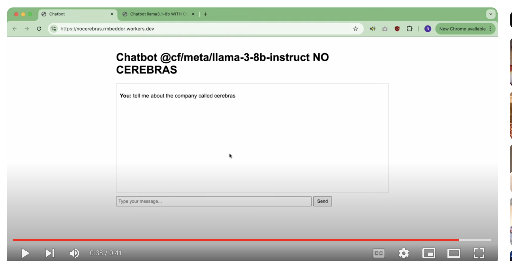
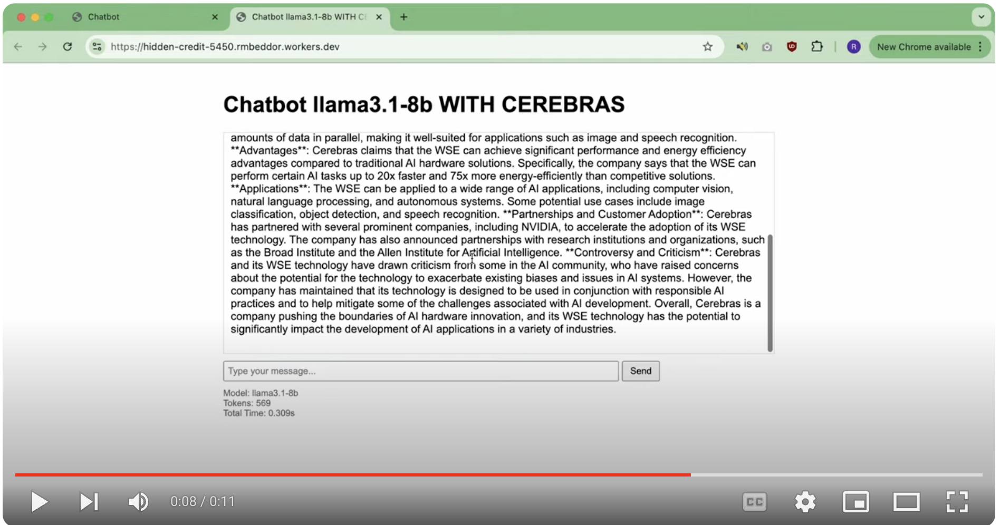

# See How Fast Cerebras Is! 

### Background
- I attended an evening event from CloudFlare, Weaviate, and Cerebras Event on 09-03-2024
- I made this entire demo in like an hour and a half and I'm super proud of that! It goes without saying that a combination of gen ai tools wrote most of this code 😜
- I didn't use Weaviate because I had already explored their software. But super grateful to Weaviate and their awesome Dev Advocate for hosting this event!! 
- I was most interested in exploring the [Cerebras](https://cerebras.ai/) performance. This was not just because a certain gpu company's stock is funding my career break and I want to have a heads up if Cerebras is going to tank them (just kidding!!!) but also because I have a feeling that we are at the very, very beginning of ai adoption - as more and more businesses start adopting gen ai in their software and processes, the demand for inference will outpace the demand for training hardware. IDK I don't have a crystal ball though. 🔮
- my intention isn't really to *compare* cloudflare and cerebras, just to explore here! There are so many factors involved that there is no way I could have made a true AB test in an hour! 


### Demo 
- my demo uses two cloudflare workers 
- one uses the standard ai package from cloudflare 
- one uses the same structure, but uses Cerebras to request and answer the query 
- both use a version of `llama-3-8b` model (the no Cerebras one uses `llama-3-8b-instruct`)

#### Without Cerebras
[](https://youtu.be/R2KeB7jZKu8)

#### With Cerebras 
[](https://youtu.be/R2KeB7jZKu8)


### How to Run this Code
- I need to double check this but I think what you do is the following
- deploy a worker on cloudflare 
- change the name in the `wrangler.toml` section of this code to the name of the worker 
- then: 
    ```
    npm install -g wrangler
    wrangler login
    wrangler deploy
    ```
    - for the code with Cerebras 
    ```
    npm install @cerebras/cerebras_cloud_sdk
    wrangler login
    wrangler secret put CEREBRAS_API_KEY   
    ```

    - then fill in the secret (you can also put in your toml but I need to take it out because i'm posting this on github)


#### To Do 
- understand more deeply the differences between the two code bases (like the Cerebras one doesn't only do inference, right? how does this impact our outcome?) It's important to me to understand each difference so I can better evaluate Cerebras. 
- double check the instructions for how to run the code 
- Does cerebras play a role in other ai applications that are not generative? (e.g. the instagram algo I'm addicted to)
- make the text on the chatbot come through streaming (like chatgpt) instead of all at once so that it's a more interesting and less boring demo! 

